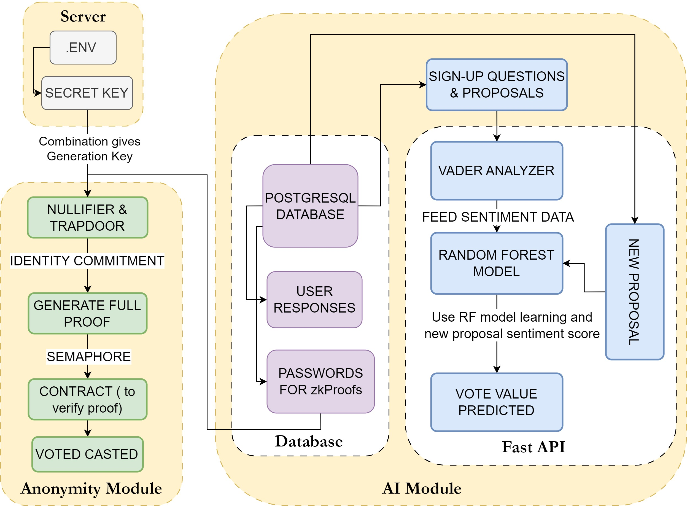

# zKhorus

zKhorus is a DAO that uses zero-knowledge proofs to ensure voter anonymity and natural language processing (NLP) for sentiment analysis to allow users to vote on proposals even if they cannot participate directly. This ensures ***100% privacy and 100% participation in the DAO.***

# How it works

The system is broken down into the following steps:

### 1. Authentication Module

- This module creates a secret key and generates a confirmation key.
- The secret key is used to generate the confirmation key.
- The confirmation key is used to generate the confirmation key.

### 2. Secret Key Generation

- This module combines various factors, including user identity and proposal details, to generate a secret key.

### 3. Generation Key

- This module uses the secret key to generate a nullifier and a trapdoor.
- The nullifier is used to prove that the user cast a vote without revealing their identity.
- The trapdoor is used to recover the user's vote in case of disputes.

### 4. Semaphore (Nullifier & Trapdoor)

- The nullifier and trapdoor are sent to the Semaphore module.
- The Semaphore module: Checks if the nullifier has already been used (preventing double voting) and Stores the nullifier and trapdoor.

### 5. PostgreSQL Database
This database stores the following information:
- Nullifier
- Encrypted vote

### 6. Generate Full Proof
- If the user cannot vote directly, this module generates a full zk-proof that proves the user's eligibility to vote and their vote choice based on the sentiment analysis. 
### 7. Semaphore (Vote Casting)

- The zk-proof and encrypted vote are sent to the Semaphore module.
The Semaphore module:
- Verifies the zk-proof using the smart contract.
- If valid, decrements the user's voting allowance (preventing exceeding vote limit).
- Stores the verified vote in the Voted Casted Database.

### 8. Contract (to verify proof)

- This smart contract verifies the zk-proof generated earlier.

### 9. Voted Casted Database

- This database stores the verified votes.

### 10. Identity Commitment

- This module commits the user's identity to a smart contract using a zk-SNARK.
- This allows the system to verify that the user is eligible to vote without revealing their identity.

### 11. Vader Analyzer

- This module analyzes the sentiment of the user's input using a sentiment analysis tool.
- The sentiment analysis tool is based on a machine learning model, such as a random forest model.
  
### 12. Random Forest Model

- This module is used to analyze the user's sentiment from past behavior and proposal details.
- The output of the model is used to determine the user's vote choice.

### 13. Fast API

- This API is used to interact with the system and cast votes.
